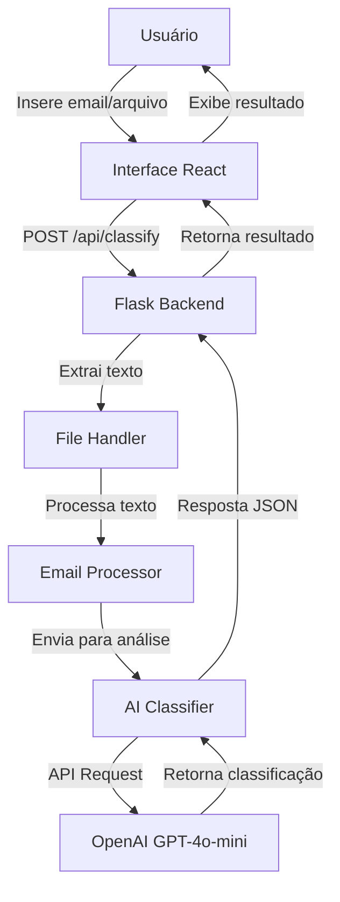

# 📧 Email Classifier - Sistema de Classificação de Emails com IA

Sistema inteligente de classificação de emails desenvolvido para automatizar a triagem de mensagens corporativas do setor financeiro, utilizando inteligência artificial para categorizar emails e sugerir respostas automáticas.

## 🎯 Objetivo

Automatizar a leitura e classificação de emails em três categorias principais:
- **Spam**: Emails suspeitos, fraudulentos ou indesejados (não salvos no histórico)
- **Produtivo**: Emails que requerem ação ou resposta específica
- **Improdutivo**: Emails que não necessitam ação imediata

O sistema também gera respostas automáticas adequadas para cada categoria identificada e protege o usuário contra emails maliciosos.

## 🚀 Tecnologias Utilizadas

### Backend
- **Python 3.11**: Linguagem principal
- **Flask**: Framework web
- **OpenAI GPT-4o-mini**: Modelo de IA para classificação e geração de respostas
- **PyPDF2**: Processamento de arquivos PDF
- **Flask-CORS**: Habilitação de requisições cross-origin

### Frontend
- **React 18**: Biblioteca para construção da interface
- **Axios**: Cliente HTTP para requisições
- **CSS3**: Estilização moderna com gradientes e animações

### Deploy
- **Render**: Plataforma de hospedagem na nuvem
- **Gunicorn**: Servidor WSGI para produção

## 📁 Estrutura do Projeto

```
autou-desafio/
├── backend/
│   ├── app.py                      # Servidor Flask principal
│   ├── wsgi.py                     # Configuração WSGI
│   ├── requirements.txt            # Dependências Python
│   ├── .env.example                # Exemplo de variáveis de ambiente
│   ├── services/
│   │   ├── email_processor.py      # Processamento de texto e NLP
│   │   └── ai_classifier.py        # Integração com OpenAI
│   └── utils/
│       └── file_handler.py         # Manipulação de arquivos
├── frontend/
│   ├── public/
│   │   └── index.html              # HTML principal
│   ├── src/
│   │   ├── App.jsx                 # Componente principal
│   │   ├── App.css                 # Estilos principais
│   │   ├── index.jsx               # Entrada da aplicação
│   │   ├── components/
│   │   │   ├── EmailInput.jsx      # Input de texto
│   │   │   ├── FileUpload.jsx      # Upload de arquivos
│   │   │   ├── ResultDisplay.jsx   # Exibição de resultados
│   │   │   └── LoadingSpinner.jsx  # Indicador de carregamento
│   │   └── services/
│   │       └── api.js              # Cliente da API
│   └── package.json                # Dependências Node.js
├── render.yaml                     # Configuração do Render
├── build.sh                        # Script de build
└── README.md                       # Este arquivo
```

## 🔧 Instalação e Execução Local

### Pré-requisitos
- Python 3.11 ou superior
- Node.js 18 ou superior
- Conta na OpenAI com API Key

### Passo 1: Clonar o Repositório

```bash
git clone <url-do-repositorio>
cd autou-desafio
```

### Passo 2: Configurar Backend

```bash
cd backend
python -m venv venv

# Windows
venv\Scripts\activate

# Linux/Mac
source venv/bin/activate

pip install -r requirements.txt
```

### Passo 3: Configurar Variáveis de Ambiente

Crie um arquivo `.env` na pasta `backend/`:

```env
OPENAI_API_KEY=sua_chave_api_aqui
FLASK_ENV=development
```

### Passo 4: Obter API Key da OpenAI

1. Acesse [https://platform.openai.com/](https://platform.openai.com/)
2. Faça login ou crie uma conta
3. Vá em **API Keys** no menu lateral
4. Clique em **Create new secret key**
5. Copie a chave gerada e cole no arquivo `.env`

**Importante**: A OpenAI oferece créditos gratuitos para novos usuários. Após o uso dos créditos, será necessário adicionar um método de pagamento.

### Passo 5: Configurar Frontend

```bash
cd ../frontend
npm install
```

Crie um arquivo `.env` na pasta `frontend/`:

```env
REACT_APP_API_URL=http://localhost:5000
```

### Passo 6: Executar a Aplicação

Em um terminal, inicie o backend:

```bash
cd backend
source venv/bin/activate  # ou venv\Scripts\activate no Windows
python app.py
```

Em outro terminal, inicie o frontend:

```bash
cd frontend
npm start
```

A aplicação estará disponível em `http://localhost:3000`

## 🎨 Como Usar

1. **Acesse a interface web**
2. **Escolha uma das opções**:
   - Digite o texto do email diretamente na área de texto
   - Faça upload de um arquivo (.txt ou .pdf)
3. **Clique em "Classificar Email"**
4. **Visualize o resultado**:
   - Categoria (Spam/Produtivo/Improdutivo)
   - Resposta automática sugerida (ou aviso de segurança se for spam)
   - Estatísticas da análise
   - **Nota**: Emails identificados como spam não são salvos no histórico por questões de segurança

## 🔄 Fluxo de Funcionamento



## 🌐 Deploy na Nuvem (Render)

### Passo 1: Preparar Repositório

Certifique-se de que todos os arquivos estejam commitados no Git:

```bash
git add .
git commit -m "Preparar para deploy"
git push origin main
```

### Passo 2: Criar Serviço no Render

1. Acesse [https://render.com/](https://render.com/)
2. Faça login ou crie uma conta
3. Clique em **New** → **Web Service**
4. Conecte seu repositório GitHub
5. Configure:
   - **Name**: email-classifier
   - **Environment**: Python
   - **Build Command**: `bash build.sh`
   - **Start Command**: `cd backend && gunicorn --bind 0.0.0.0:$PORT app:app`

### Passo 3: Adicionar Variáveis de Ambiente

Na seção **Environment**, adicione:
- `OPENAI_API_KEY`: Sua chave da API OpenAI
- `PYTHON_VERSION`: 3.11.0

### Passo 4: Deploy

Clique em **Create Web Service**. O Render fará o build e deploy automaticamente.

## 🧪 Exemplos de Teste

### Email Spam
```
De: Promoções Incríveis <sorteio.premios.2026@outlook-mail.tk>
Para: João Pedro <joaopsj007@gmail.com>
Assunto: 🎉 PARABÉNS! Você Ganhou R$ 50.000,00! 🎉

PARABÉNS! Você foi SELECIONADO como o grande vencedor!
Você ganhou o prêmio de R$ 50.000,00!

Para receber, você precisa:
1. CLICAR AQUI IMEDIATAMENTE
2. Preencher seus dados bancários completos
3. Informar sua senha do banco

⚠️ ATENÇÃO: Válido APENAS HOJE!
```

### Email Produtivo
```
Prezados,

Estou com um problema urgente no sistema de pagamentos. 
Desde ontem não consigo processar transações e os clientes 
estão relatando erros. Preciso de suporte técnico imediato.

Att,
João Silva
```

### Email Improdutivo
```
Oi pessoal!

Queria desejar um Feliz Natal a todos da equipe! 
Que 2024 seja um ano incrível para todos nós.

Abraços,
Maria Santos
```

## 🔒 Segurança

- API Keys armazenadas em variáveis de ambiente
- Validação de tipos de arquivo no backend
- Limite de tamanho de arquivo (5MB)
- Sanitização de inputs
- CORS configurado adequadamente
- **Detecção automática de spam e phishing**
- **Emails maliciosos não são salvos no histórico**
- **Alertas visuais para emails suspeitos**

## 📊 Funcionalidades Principais

✅ **Detecção automática de spam e emails maliciosos**  
✅ Classificação automática em Spam/Produtivo/Improdutivo  
✅ Geração de respostas automáticas contextualizadas  
✅ Alertas de segurança para emails suspeitos  
✅ Histórico de classificações (exceto spam)  
✅ Envio de respostas via Gmail  
✅ Suporte para texto direto e upload de arquivos  
✅ Interface moderna e responsiva  
✅ Drag-and-drop para upload de arquivos  
✅ Estatísticas detalhadas da análise  
✅ Indicador de status do servidor  
✅ Feedback visual em tempo real  

## 🛠️ Processamento de Linguagem Natural

O sistema utiliza técnicas de NLP para:
- Limpeza e normalização de texto
- Remoção de URLs e emails sensíveis
- Identificação de palavras-chave produtivas/improdutivas
- Análise contextual usando GPT-4o-mini

## 🎯 Categorias de Classificação

### Spam (Prioridade Máxima)
Emails suspeitos, fraudulentos ou indesejados:
- Phishing e tentativas de roubo de dados
- Promessas de dinheiro fácil ou prêmios
- Pedidos de senha ou dados bancários
- Links suspeitos e ofertas "bom demais para ser verdade"
- Urgência exagerada e vendas agressivas não solicitadas
- Correntes, pirâmides e esquemas fraudulentos
- **Importante**: Não são salvos no histórico por segurança

### Produtivo
Emails que indicam necessidade de ação:
- Solicitações de suporte técnico
- Dúvidas sobre o sistema
- Atualização sobre casos em aberto
- Problemas e erros
- Requisições urgentes
- Ofertas legítimas de trabalho/estágio

### Improdutivo
Emails sem necessidade de ação imediata:
- Mensagens de felicitações
- Agradecimentos
- Mensagens sociais
- Comunicados informais

## 📈 Estatísticas Fornecidas

Para cada email classificado, o sistema fornece:
- Número de caracteres
- Contagem de palavras
- Indicadores produtivos identificados
- Indicadores improdutivos identificados
- Nível de confiança da classificação

## 🤝 Contribuindo

Este projeto foi desenvolvido como parte do desafio técnico da AutoU.

## 📝 Licença

Este projeto foi desenvolvido para fins educacionais e de avaliação técnica.

## 👨‍💻 Desenvolvedor

Desenvolvido com dedicação para o Desafio AutoU 🚀

---

**Powered by OpenAI GPT-4o-mini** | **Built with Flask & React**